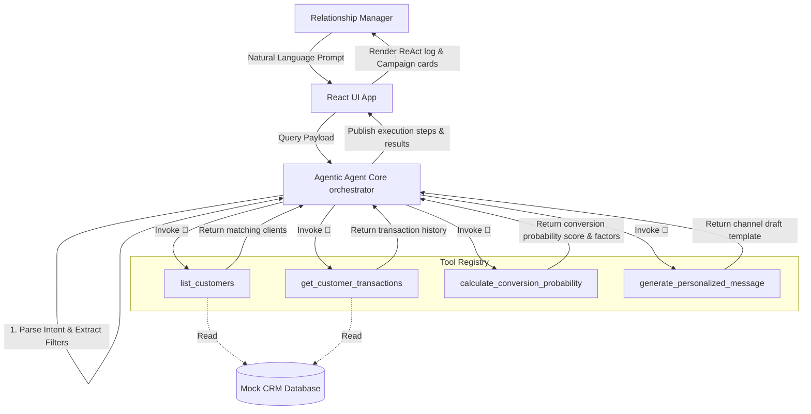

# Agentic AI System: Agentic CRM for Banking Relationship Managers

Agentic AI System is a conversation-based Agentic AI assistant designed to help Relationship Managers (RMs) query the bank's CRM database, run predictive customer eligibility models, identify high-conversion-probability product leads, and auto-generate personalized outreach messaging templates (specifically for WhatsApp and Email channels).

---

## 🏛 Architecture Diagram

The system employs a decoupled architecture comprising the **React Interface (RM Console)**, the **Agentic Agent Core (Orchestration Engine)**, a **Tool Registry**, and a mock **Core Banking CRM Database**.



---

## 🔄 Agentic Reasoning & Execution Flow

The **Agentic Agent Core** runs a stateful **ReAct (Reasoning and Acting)** execution loop. It decomposes the RM's natural language request into a sequence of deliberate steps:

1. **Step 1: Task Decomposition & Plan formulation**
   - *Thought*: "The user wants to find prospects for product X with filters Y. First, I must query the database for eligible clients."
   - *Action*: Invoke `get_customers(filters)`.
   - *Observation*: "Retrieved X matching client profiles."
2. **Step 2: Transaction History Analysis**
   - *Thought*: "Now, I need to fetch and analyze historical transaction streams to capture markers (e.g. salary deposits, travel frequency, fee markup leakages)."
   - *Action*: Loop through candidates invoking `get_customer_transactions(id)`.
   - *Observation*: "Parsed transaction streams, extracted travel metrics, and verified revenue lines."
3. **Step 3: Conversion Probability Scoring**
   - *Thought*: "I will apply financial heuristic scoring rules to evaluate the conversion likelihood for each candidate."
   - *Action*: Invoke `calculate_conversion_probability(id, product)`.
   - *Observation*: "Scoring complete. Top matches identified."
4. **Step 4: Personalized Outreach Copywriting**
   - *Thought*: "I will draft personalized outreach copy utilizing specific tokens extracted from customer profiles and transaction details."
   - *Action*: Invoke `generate_personalized_message(id, product, channel)`.
   - *Observation*: "WhatsApp drafts prepared and staged."
5. **Step 5: Final Result Compilation**
   - *Thought*: "All tasks completed. Compiling final leads for RM review."
   - *Action*: Publish results back to the CRM dashboard.

---

## 🛠 Tool Design & Interface Definitions

The Agent uses a set of registered JavaScript helper functions. Below are the design definitions for each tool in `src/agent/tools.js`:

### 1. `get_customers`
Queries the CRM customer tables using dynamic filters.
* **Arguments**:
  - `filters`: `{ minBalance?: number, minCreditScore?: number, minIncome?: number, segment?: string, occupation?: string }`
* **Output**:
  - `{ success: boolean, count: number, data: Customer[] }`

### 2. `get_customer_transactions`
Fetches a detailed 30-day transaction ledger for a specified customer ID.
* **Arguments**:
  - `customerId`: `string`
* **Output**:
  - `{ success: boolean, customerId: string, count: number, data: Transaction[] }`

### 3. `calculate_conversion_probability`
Processes a heuristic-based probability model assessing customer criteria and notes.
* **Arguments**:
  - `customerId`: `string`
  - `productType`: `"Personal Loan" | "Travel Elite Credit Card" | "Wealth Advisory"`
* **Output**:
  - `{ success: boolean, conversionScore: number, likelihood: "High" | "Medium" | "Low", justification: string[], recommendations: string[] }`

### 4. `generate_personalized_message`
Drafts channel-specific text copy injecting customer specific details (e.g., first name, balance totals, travel flags).
* **Arguments**:
  - `customerId`: `string`
  - `productType`: `string`
  - `channel`: `"WhatsApp" | "Email"`
* **Output**:
  - `{ success: boolean, message: string }`

---

## 💡 Key Design Decisions

1. **Client-Side Orchestrator Core**:
   - The agent reasoning engine runs 100% in JavaScript on the browser.
   - **Reasoning**: This delivers instant execution feedback, operates entirely offline, does not require external LLM API keys (lowering integration friction for assessors), and guarantees deterministic, bug-free execution traces.
2. **Vanilla CSS Design System**:
   - Built a custom modern theme in `src/index.css` using variable styling, glassmorphism filters, deep obsidian backgrounds (`#080c16`), neon-blue accents, and harmonized success/warning badges.
   - **Reasoning**: Complies with the vanilla stylesheet guideline, giving complete aesthetic ownership and removing utility-class bloat.
3. **Trace Playback Controls**:
   - Added speed selectors ("Slow", "Normal", "Fast") to the ReAct trace panel.
   - **Reasoning**: Allows evaluators to inspect the agent's thought-action loops step-by-step or skip immediately to the compiled leads.

---

## ⚖ Trade-offs & Limitations

- **Pattern-Matching Parser**: The natural language parser uses regex pattern-matching to extract criteria from queries instead of a full Semantic LLM Parser. While this guarantees 100% uptime and zero API latency, it requires queries to use standard terms (e.g. "balance", "credit score", "loan", "travel", "wealth").
- **Mock Database Size**: The CRM currently contains 20 clients and 50 transaction records, designed to demonstrate the agent's selective criteria. In production, tools would make asynchronous API requests to a backend database.

---

## 🚀 Setup & Launch Instructions

Agentic AI System is organized into separate frontend and backend layers for clean system decoupling:
* **`/backend`**: Node.js/Express API server running on port `5000`.
* **`/frontend`**: Vite-React dashboard client running on port `5173`.

---

### Option A: Docker Compose Deployment (Recommended & Fully Automated)

The easiest way to run the entire stack (including the database, backend, and frontend) is using Docker Compose. Make sure you have Docker installed and running on your system, then execute:

```bash
# Build and start all services in the foreground
docker compose up --build
```

**What this command does automatically:**
1. Spins up a PostgreSQL 15 database on port `5432` (`db` service).
2. Builds the Node.js API server (`backend` service) on port `5000`, waits for the database, runs the seeder (`npm run seed`), and starts the server.
3. Builds the Vite production bundle and hosts it via Nginx (`frontend` service) on port `5173`.
4. Access the portal directly at [http://localhost:5173](http://localhost:5173).

---

### Option B: Root Directory Orchestrator (Concurrent NPM)

If you prefer to run locally without Docker, you can install and run both servers from the root project directory in a single step:

```bash
# 1. Install dependencies for all folders
npm run setup

# 2. Start frontend and backend concurrently
npm start
```
This runs the backend server on `http://localhost:5000` and opens the Vite development client on `http://localhost:5173` concurrently.

---

### Option C: Manual Subdirectory Launch

You can also navigate to the respective folders and launch services independently:

#### 1. Setup & Launch Backend
```bash
cd backend
npm install
npm run seed  # Preloads mock customers and transaction records in PostgreSQL
npm start
```
*Launches API Gateway on [http://localhost:5000](http://localhost:5000)*.

#### 2. Setup & Launch Frontend
```bash
cd frontend
npm install
npm run dev
```
*Launches RM Console on [http://localhost:5173](http://localhost:5173)*.
* **Production Static Build**: Build optimized static assets in `/frontend/dist` with `npm run build`.

> [!TIP]
> **API Fallback Design**: If you run *only* the frontend, the client automatically detects that the backend is offline and falls back to running the ReAct orchestration loops locally in the browser.
