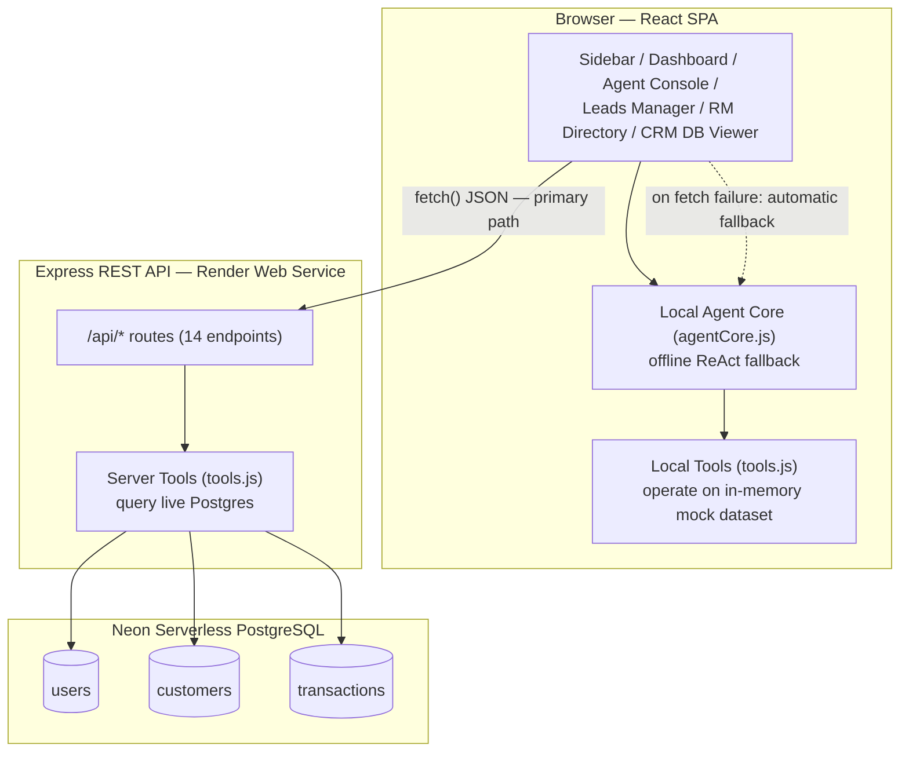
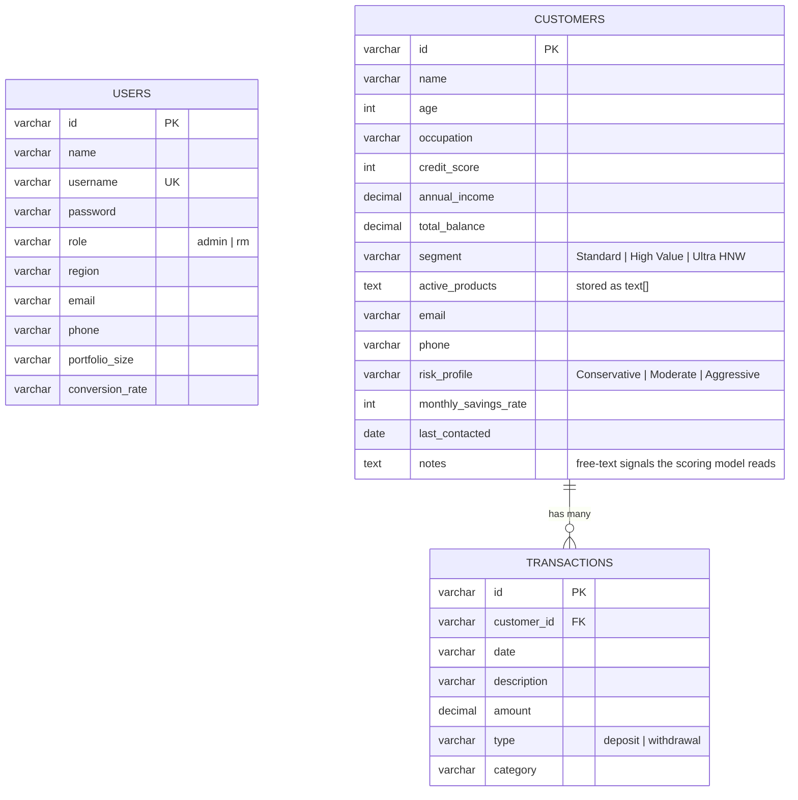

# Agentic AI System — Conversational Agentic AI for Banking CRM

A conversation-based Agentic AI system that helps a bank Relationship Manager (RM) go from a single natural-language request — *"Find high-value customers likely to convert for a personal loan this month and generate personalized WhatsApp messages"* — to a ranked, scored, and individually-personalized outreach campaign, with full visibility into every reasoning step the agent took to get there.

Built for the **Take-Home Assignment: Conversation-based Agentic AI for Banking CRM**.

**Live deployment:** [agentic-crm-frontend-plwc.onrender.com](https://agentic-crm-frontend-plwc.onrender.com) · **Repo:** [Harsh24vardhan/agentic-crm-banking](https://github.com/Harsh24vardhan/agentic-crm-banking)

---

## Table of Contents

1. [Problem Statement](#problem-statement)
2. [Live Demo & Credentials](#live-demo--credentials)
3. [Requirements Coverage](#requirements-coverage)
4. [System Architecture](#system-architecture)
5. [Deployment Topology](#deployment-topology)
6. [Data Model](#data-model)
7. [Agentic Reasoning & Execution Flow](#agentic-reasoning--execution-flow)
8. [Tool Design & Interface Definitions](#tool-design--interface-definitions)
9. [REST API Reference](#rest-api-reference)
10. [Conversion Scoring Model (Heuristics)](#conversion-scoring-model-heuristics)
11. [Role-Based Access & User Flows](#role-based-access--user-flows)
12. [Key Design Decisions](#key-design-decisions)
13. [Trade-offs & Limitations](#trade-offs--limitations)
14. [Tech Stack](#tech-stack)
15. [Project Structure](#project-structure)
16. [Setup & Run Instructions](#setup--run-instructions)
17. [Environment Variables](#environment-variables)
18. [Demo Video Guide](#demo-video-guide)

---

## Problem Statement

> A Relationship Manager asks: *"Find high-value customers likely to convert for a personal loan this month and generate personalized WhatsApp messages."*

The system must, without hardcoded output:
- Retrieve relevant customer and transaction data
- Identify high-value customers
- Estimate likelihood of conversion (rules/heuristics)
- Recommend a suitable product
- Generate a personalized outreach message per customer

Everything below documents how each of these is implemented and why.

---

## Live Demo & Credentials

| Service | URL |
|---|---|
| Frontend (RM Console) | https://agentic-crm-frontend-plwc.onrender.com |
| Backend (REST API) | https://agentic-crm-backend-i621.onrender.com |
| Health check | https://agentic-crm-backend-i621.onrender.com/health |

| Role | Username | Password | Lands on |
|---|---|---|---|
| Admin | `admin` | `password123` | RM Directory (create/manage RMs) |
| Relationship Manager | `sarah` | `password123` | Home Console (Agent, Leads, CRM DB) |

> Render's free tier suspends services after ~15 minutes of inactivity. The first request after idle can take 30–60s to wake up — this is a hosting-tier characteristic, not an application bug.

---

## Requirements Coverage

Direct mapping against the assignment brief, so it's auditable at a glance.

### Expected Capabilities

| Requirement | Implementation | Where |
|---|---|---|
| Retrieve relevant customer and transaction data | `get_customers`, `get_customer_transactions` tools query the live CRM tables | [`tools.js`](frontend/src/agent/tools.js), `GET /api/customers`, `GET /api/transactions/:id` |
| Identify high-value customers | Composable filters — balance, income, credit score, segment, risk profile — parsed from free text | `parseQueryIntent()` in [`agentCore.js`](frontend/src/agent/agentCore.js) |
| Estimate likelihood of conversion (rules/heuristics) | Per-product weighted heuristic scoring (not ML, not hardcoded) using income, credit score, balance, transaction patterns, and free-text profile notes | `calculate_conversion_probability()` — see [Conversion Scoring Model](#conversion-scoring-model-heuristics) |
| Recommend suitable products | Product intent detected from the query (`Personal Loan` / `Travel Elite Credit Card` / `Wealth Advisory`) plus a `recommendations[]` list per lead | `parseQueryIntent()`, `calculate_conversion_probability()` |
| Generate personalized outreach messages | Message copy branches on real customer signals (loan expiry, occupation, travel notes, risk profile, segment) — never a static template | `generate_personalized_message()` |

### Expectations

| Requirement | How it's satisfied |
|---|---|
| Clear task decomposition | The agent runs a fixed 5-step plan (list → analyze → score → draft → compile), each with an explicit Thought/Action/Observation, rendered live in the Agent Console trace panel |
| Effective tool/API usage | 4 composable agent tools + a 14-route Express REST API + PostgreSQL — see [REST API Reference](#rest-api-reference) |
| Structured reasoning and execution flow | See the [sequence diagram](#agentic-reasoning--execution-flow) below — every step's Thought/Action/Observation is logged and replayed in the UI at adjustable speed |
| Proper state/context handling | Session state persisted in `localStorage`; agent trace state, leads hand-off from Agent Console → Leads Manager, and role-based routing all flow through explicit React state, not globals |
| Modular and extensible design | Strict separation: `/agent` (reasoning + tools), `/components` (presentation), `/db` (persistence), `/context` (cross-cutting UI concerns) — see [Project Structure](#project-structure) |

### Deliverables

- ✅ **GitHub Repository** — this repo, with the separation above
- ✅ **README** — architecture diagrams, execution flow, tool design, design decisions, trade-offs, setup instructions (this document)
- ⏳ **Demo Video (5–10 min)** — not produced by this session (I can write code and deploy, but can't record a screen video). See [Demo Video Guide](#demo-video-guide) for a ready-to-follow script covering 3+ use cases and architecture trade-offs.

### Avoiding disqualification criteria

- **"Hardcoded outputs without reasoning"** — every score is computed from live customer/transaction fields at request time (see the actual weighted rules in [Conversion Scoring Model](#conversion-scoring-model-heuristics)); every message branches on real profile content, not a fixed string.
- **"No meaningful tool usage"** — 4 distinct tools invoked in sequence with data dependencies between steps (step 3 depends on step 1's output, step 4 depends on step 3's ranking).
- **"Poor or missing documentation"** — this README.

---

## System Architecture

The system has two agent execution paths that share the same tool contracts: a **server-backed path** (Express + Postgres, the canonical source of truth) and a **client-side fallback path** (identical tool logic running against an in-memory dataset in the browser). Every data-fetching component tries the API first and transparently falls back if it's unreachable — see [Key Design Decisions](#key-design-decisions) for why.



---

## Deployment Topology


- **Frontend**: static Vite build, served by Render's static host with a SPA catch-all rewrite (`/* → /index.html`) so client-side routes survive refresh/direct navigation.
- **Backend**: Node/Express web service. Build step runs `npm install && npm run seed` — the seeder creates the schema and inserts baseline data on every deploy (see [Trade-offs](#trade-offs--limitations) for the implication of this).
- **Database**: Neon's serverless Postgres — connects over `DATABASE_URL` with SSL, autoscaling compute down to zero when idle.
- Also portable to **Docker Compose** (local Postgres) or **Fly.io/Koyeb** (config already present as `fly.toml` / Dockerfile) — the app has no hosting-specific code paths.

---

## Data Model



`notes` is the highest-leverage field in the schema — it's unstructured free text (e.g. *"active personal loan expiring next month"*, *"frequent business trips to Italy"*), and both the scoring model and the message generator read it directly to drive personalization. This is the deliberate design choice that keeps outputs from feeling templated.

---

## Agentic Reasoning & Execution Flow

The **Agent Core** runs a fixed, stateful **ReAct (Reasoning → Acting → Observation)** loop. It never asks a language model to freelance the plan — the plan is deterministic (5 steps), but every step's *content* (what it found, how many, which names) is computed live from real data, and the trace is rendered to the RM step-by-step so the reasoning is auditable, not a black box.

```mermaid
sequenceDiagram
    actor RM as Relationship Manager
    participant UI as Agent Console (React)
    participant Core as Agent Core (ReAct loop)
    participant T1 as get_customers
    participant T2 as get_customer_transactions
    participant T3 as calculate_conversion_probability
    participant T4 as generate_personalized_message
    participant DB as CRM Database

    RM->>UI: "Find high-value customers likely to convert for a personal loan..."
    UI->>Core: runAgent(query)
    Core->>Core: parseQueryIntent() → {productType, filters}

    rect rgb(30, 41, 59)
    note over Core: Step 1 — Task Decomposition & Plan
    Core->>T1: get_customers(filters)
    T1->>DB: SELECT * FROM customers WHERE ...
    DB-->>T1: matching rows
    T1-->>Core: {success, count, data}
    end

    rect rgb(30, 41, 59)
    note over Core: Step 2 — Transaction History Analysis
    loop for each candidate
        Core->>T2: get_customer_transactions(id)
        T2->>DB: SELECT * FROM transactions WHERE customer_id = ...
        DB-->>T2: transaction rows
        T2-->>Core: travel / salary / recency markers
    end
    end

    rect rgb(30, 41, 59)
    note over Core: Step 3 — Conversion Probability Scoring
    loop for each candidate
        Core->>T3: calculate_conversion_probability(id, productType)
        T3-->>Core: {score, likelihood, justification[], recommendations[]}
    end
    Core->>Core: sort leads by score, descending
    end

    rect rgb(30, 41, 59)
    note over Core: Step 4 — Personalized Outreach Drafting
    loop for each scored lead
        Core->>T4: generate_personalized_message(id, productType, channel)
        T4-->>Core: personalized WhatsApp/Email draft
    end
    end

    note over Core: Step 5 — Final Compilation
    Core-->>UI: {steps[], leads[], productType}
    UI-->>RM: Trace playback + ranked lead cards + editable outreach drafts
```



Each step in the actual code carries a real `thought`, `action`, `toolCall`, and `observation` string built from the live result (e.g. *"Found 7 customers matching basic filters. Candidate list: [Sarah Jenkins, David Chen, ...]"*) — not a canned label. The Agent Console lets the RM replay this at **Slow / Normal / Fast** speed or skip straight to the compiled leads.

---

## Tool Design & Interface Definitions

Registered functions in [`frontend/src/agent/tools.js`](frontend/src/agent/tools.js) (client fallback) and [`backend/src/agent/tools.js`](backend/src/agent/tools.js) (server, backed by Postgres via `db/index.js`) — identical contracts, different data source.

### 1. `get_customers(filters)`
Queries the CRM customer table with composable filters.
- **Arguments**: `{ minBalance?, minCreditScore?, minIncome?, segment?, riskProfile?, occupation?, name? }`
- **Output**: `{ success: boolean, count: number, data: Customer[] }`

### 2. `get_customer_transactions(customerId)`
Fetches the full transaction ledger for one customer.
- **Arguments**: `customerId: string`
- **Output**: `{ success: boolean, customerId, customerName, count, data: Transaction[] }`

### 3. `calculate_conversion_probability(customerId, productType)`
Runs the heuristic scoring model (full rules in the [next section](#conversion-scoring-model-heuristics)).
- **Arguments**: `customerId: string`, `productType: "Personal Loan" | "Travel Elite Credit Card" | "Wealth Advisory"`
- **Output**: `{ success, customerId, customerName, productType, conversionScore: 0-100, likelihood: "High"|"Medium"|"Low", justification: string[], recommendations: string[] }`

### 4. `generate_personalized_message(customerId, productType, channel)`
Drafts channel-specific copy, branching on the customer's real notes/segment/risk profile.
- **Arguments**: `customerId`, `productType`, `channel: "WhatsApp" | "Email"`
- **Output**: `{ success, customerId, customerName, productType, channel, message }`

---

## REST API Reference

Express server ([`backend/server.js`](backend/server.js)), all routes prefixed by the deployed backend origin.

| Method | Route | Purpose |
|---|---|---|
| `GET` | `/health` | Liveness + DB connectivity status |
| `GET` | `/api/customers` | List customers, with query-string filters |
| `POST` | `/api/customers` | Add a new CRM customer |
| `PUT` | `/api/customers/:id` | Update an existing customer profile |
| `GET` | `/api/transactions` | List all transactions |
| `GET` | `/api/transactions/:customerId` | Transaction ledger for one customer |
| `POST` | `/api/transactions` | Log a new transaction |
| `GET` | `/api/score/:customerId/:productType` | Run the scoring model for one customer/product pair |
| `GET` | `/api/outreach/:customerId/:productType/:channel` | Generate one personalized message |
| `POST` | `/api/agent` | Full natural-language query → ReAct run → ranked leads |
| `POST` | `/api/auth/login` | Username/password authentication |
| `GET` | `/api/rms` | List Relationship Managers (admin) |
| `POST` | `/api/rms` | Create a new RM account (admin) |
| `GET` | `/api/logs` | In-memory ring buffer of recent request logs (ops/debugging) |

---

## Conversion Scoring Model (Heuristics)

This is the part that proves the output isn't hardcoded: three independent weighted rule sets, one per product, each reading different real fields off the customer record.

**Personal Loan** — starts at 0, then:
- `+25` if annual income > ₹120k, `+15` if > ₹80k, `−20` if < ₹40k
- `+25` if credit score ≥ 750, `+15` if ≥ 680, `−30` if below
- `+30` if notes mention financing/liquidity/expansion intent
- `+35` if notes indicate an *existing* loan is expiring (refinance signal — this is the single strongest positive factor in the model)
- `−40` if notes explicitly state reluctance to take on debt
- `+10` if total balance > ₹100k (asset backing)
- Clamped to `[5, 98]`

**Travel Elite Credit Card**:
- `+45` for 3+ travel transactions in the last 30 days, `+20` for 1–2
- `+25` for foreign-transaction fees or international-travel notes
- `+20` if credit score ≥ 720, `−35` if < 640
- Score forced to `5` if the customer already holds a travel card (no point pitching a duplicate)

**Wealth Advisory**:
- `+50` for Ultra HNW balance (≥ ₹300k), `+35` for High Value (≥ ₹100k), `−40` if < ₹20k
- `+25` for explicit wealth/estate-planning interest in notes
- `+15` if funds are sitting in low-yield savings products (an upsell signal)
- Score forced to `15` if already enrolled in full wealth management

Final `likelihood` label: **High** (score > 75), **Medium** (> 45), **Low** (otherwise). Every contributing factor is returned in `justification[]` and rendered verbatim in the UI, so the RM sees *why* a lead scored the way it did, not just the number.

Message generation ([`generate_personalized_message`](frontend/src/agent/tools.js)) branches similarly — e.g. a Personal Loan message reads differently for a customer whose notes say "loan expiring next month" (refinance-toned) versus a dentist with "practice expansion" notes (equipment-financing-toned) versus a generic pre-approval.

---

## Role-Based Access & User Flows


| Capability | Admin | Relationship Manager |
|---|---|---|
| Create/list RM accounts | ✅ | ❌ |
| Browse/edit CRM customers & transactions | ✅ | ✅ |
| Run the Agent Console (NL queries) | ❌ | ✅ |
| View Dashboard metrics | ❌ | ✅ |
| Campaign Leads / outreach dispatch | ❌ | ✅ |
| Own profile & preferences | ❌ (fixed identity) | ✅ |

---

## Key Design Decisions

1. **Dual-path agent execution (server + client fallback)**
   Every network call is wrapped so that if the Express API is unreachable, the exact same tool logic re-runs against an in-memory dataset in the browser. This means the app is demoable with zero backend running, and never shows a dead end if Render's free tier is cold-starting.

2. **Deterministic plan, live content** — see [Execution Flow](#agentic-reasoning--execution-flow). The 5-step plan is fixed; every thought/observation string inside it is generated from the actual query result, not a template.

3. **Rule-based heuristic scoring over ML** — a transparent, inspectable weighted-rule model (see above) instead of a black-box classifier. For a CRM tool an RM has to trust and explain to a compliance reviewer, "here are the 4 reasons this customer scored 82%" is more valuable than an opaque model score.

4. **Vanilla CSS design system** — a custom theme (`index.css`) using CSS variables, glassmorphism, and a dark-navy/neon-cyan palette with a full light-theme override, rather than a utility framework. Gives complete visual ownership and keeps the bundle lean.

5. **Global toast notification system** — a single `ToastProvider`/`useToast()` context (`frontend/src/context/ToastContext.jsx`) replaced several one-off local toast implementations, so every mutating action (login, logout, RM creation, customer add/update, transaction logging, lead dispatch, agent scan completion) reports success/error consistently from one place.

6. **Real communication deep-links, not just simulation** — the dispatch modal keeps its animated "CRM Gateway" simulation for the demo narrative, but also offers **Open in WhatsApp** (`wa.me/<phone>?text=<message>`) and **Open in Email App** (`mailto:`) buttons that hand off to the RM's real client with the generated message pre-filled.

7. **Responsive layout via CSS breakpoints, not a JS drawer** — the sidebar collapses to an icon-only rail below 820px purely through media queries (no new component state), keeping the change surface small. Tables already scroll horizontally and modals already cap at `90vw`, so most of the layout degrades gracefully by default.

8. **INR display localization** — all currency in the UI, message templates, and the NL query parser uses `₹` instead of `$`. This is a **display-symbol change only** — see [Trade-offs](#trade-offs--limitations).

9. **Infrastructure-as-config across three providers** — `render.yaml`, `fly.toml`, and `docker-compose.yml` all describe the same service topology, so the same codebase deploys unmodified to Render, Fly.io, or a local Docker stack.

---

## Trade-offs & Limitations

- **Pattern-matching NL parser, not an LLM parser.** `parseQueryIntent()` uses regex/keyword matching, not a language model. This guarantees zero API latency, zero cost, and 100% uptime for the assignment's demo queries, but it requires roughly standard phrasing (recognizes "balance", "credit score", "loan", "travel", "wealth", etc.) and won't handle arbitrary paraphrasing or multi-intent queries the way an LLM-backed parser would.
- **Currency is a symbol swap, not an FX conversion.** Per a later request, all `$` were changed to `₹` — the underlying numeric magnitudes are unchanged from the original mock dataset. A customer shown as "₹135,000 income" has the same numeral as it did as "$135,000"; there's no real USD→INR rate applied. Worth knowing if the numbers are read literally.
- **Dispatch is simulated + optionally deep-linked, not a real send.** The animated "Broadcasting via Twilio API..." sequence is a UX simulation. The WhatsApp/Email buttons *do* open a real compose window via `wa.me`/`mailto:`, but nothing in this codebase calls an actual messaging/SMTP provider (e.g. Twilio, SendGrid) — that would be the next integration point.
- **Database reseeds on every backend deploy.** Render's build command is `npm install && npm run seed`, and `seed.js` drops and recreates all three tables before inserting baseline data. Any RM or customer added through the UI in production is lost on the next deploy. Fixable by making the seed idempotent (skip if `users` is non-empty) — flagged but not changed, since it would alter existing deploy behavior without an explicit go-ahead.
- **Plaintext passwords.** The `users.password` column stores plaintext (fine for a take-home demo login, not production-appropriate — would need bcrypt hashing).
- **Mock dataset size.** 20 customers, ~50 transactions — enough to demonstrate selective filtering and varied scoring outcomes, not a production-scale dataset.
- **No automated test suite.** Verification in this project has been manual + headless-browser smoke checks during development, not a CI test suite.
- **Render free-tier cold starts.** Both services sleep after ~15 min idle; first request after that takes 30–60s.

---

## Tech Stack

| Layer | Choice |
|---|---|
| Frontend | React 19, Vite 8, vanilla CSS (custom design system), `lucide-react` icons |
| Backend | Node.js, Express 4 |
| Database | PostgreSQL — Neon (serverless, production) / Docker `postgres:15-alpine` (local) |
| Linting | `oxlint` |
| Deployment | Render (backend web service + frontend static site), Neon (managed Postgres) |
| Alternate deploy targets | Fly.io (`fly.toml`), Koyeb/Docker (`Dockerfile`), Docker Compose (full local stack) |

---

## Project Structure

```
Assingment/
├── backend/
│   ├── server.js                 # Express app, 14 REST routes
│   ├── src/
│   │   ├── agent/
│   │   │   ├── agentCore.js      # Server-side ReAct orchestrator + NL parser
│   │   │   ├── tools.js          # 4 agent tools (Postgres-backed)
│   │   │   └── mockDatabase.js   # Seed data source (customers, transactions, users)
│   │   └── db/
│   │       ├── index.js          # Postgres query layer (pg Pool)
│   │       └── seed.js           # Schema creation + baseline data seeder
│   ├── Dockerfile / fly.toml / start.sh
│   └── package.json
│
├── frontend/
│   ├── src/
│   │   ├── agent/                # Client-side mirror of the agent (offline fallback)
│   │   ├── components/
│   │   │   ├── Login.jsx, Sidebar.jsx, BrandLogo.jsx
│   │   │   ├── HomePage.jsx, DashboardMetrics.jsx
│   │   │   ├── AgentConsole.jsx       # ReAct trace playback UI
│   │   │   ├── LeadsManager.jsx       # Scored leads + dispatch modal
│   │   │   ├── DatabaseViewer.jsx     # CRM customer/transaction CRUD
│   │   │   ├── RmManager.jsx          # Admin: RM directory + creation
│   │   │   └── UserProfile.jsx
│   │   ├── context/
│   │   │   └── ToastContext.jsx  # Global success/error notifications
│   │   ├── App.jsx                # Role-based routing, session state
│   │   ├── config.js              # API base URL resolution
│   │   └── index.css              # Full design system + responsive breakpoints
│   ├── public/logo.svg
│   └── package.json
│
├── docker-compose.yml             # Full local stack: Postgres + backend + frontend
├── render.yaml                    # Render Blueprint (backend + frontend + Postgres)
└── package.json                   # Root orchestrator (concurrently runs both apps)
```

---

## Setup & Run Instructions

### Option A — Docker Compose (recommended, fully automated)

```bash
docker compose up --build
```
Spins up Postgres 15, builds and seeds the backend on `:5000`, builds and serves the frontend on `:5173`. Open [http://localhost:5173](http://localhost:5173).

### Option B — Root orchestrator (no Docker)

```bash
npm run setup   # installs deps in root, backend, and frontend
npm start       # runs backend (:5000) and frontend (:5173) concurrently
```

### Option C — Manual, per-service

```bash
# Backend
cd backend
npm install
npm run seed    # creates schema + baseline data in Postgres
npm start       # http://localhost:5000

# Frontend (separate terminal)
cd frontend
npm install
npm run dev     # http://localhost:5173
```

> **Offline-capable by design**: if you run only the frontend, every component detects the failed `fetch()` and transparently falls back to the client-side agent running against an in-memory dataset — no backend required to demo the core reasoning flow.

---

## Environment Variables

### Backend
| Variable | Purpose | Default |
|---|---|---|
| `PORT` | HTTP port | `5000` (`10000` on Render) |
| `DATABASE_URL` | Full Postgres connection string (used in production/Neon) | — |
| `PGHOST` / `PGPORT` / `PGUSER` / `PGPASSWORD` / `PGDATABASE` | Discrete Postgres connection params (used if `DATABASE_URL` absent, e.g. local Docker) | `localhost` / `5432` / `postgres` / `postgres` / `observebank` |
| `NODE_ENV` | Environment flag | `development` |

### Frontend
| Variable | Purpose | Default |
|---|---|---|
| `VITE_API_BASE_URL` | Backend origin the SPA calls | `http://localhost:5000` |

---

## Demo Video Guide

Not recorded as part of this session — here's a script hitting everything the brief asks for (3+ use cases, architecture trade-offs) in ~7 minutes:

1. **(1 min) Architecture** — walk through the [System Architecture](#system-architecture) diagram: client, server, dual-path fallback, Postgres.
2. **(1 min) Use Case 1 — Personal Loan**: log in as `sarah`, Agent Console → *"Find high-value customers likely to convert for a personal loan this month and generate personalized WhatsApp messages"* → narrate the trace playback step-by-step → open a lead, show the score justification and the generated message.
3. **(1 min) Use Case 2 — Travel Card**: run the "Premium Travel Card Upgrades" preset → point out the score changes for a different heuristic rule set (travel transaction count, foreign fees).
4. **(1 min) Use Case 3 — Wealth Advisory**: run the HNW preset → show the Conservative vs. growth-oriented message branching.
5. **(1 min) Dispatch**: open a lead's dispatch modal, click **Open in WhatsApp** to show the real deep-link, then **Confirm & Send** to show the simulated CRM gateway animation.
6. **(1 min) Admin side**: log out, log in as `admin`, create a new RM, show the RM Directory.
7. **(1 min) Trade-offs**: mention the regex NL parser vs. an LLM parser, the reseed-on-deploy caveat, and the offline fallback design — see [Trade-offs & Limitations](#trade-offs--limitations) for the full list to draw from.
