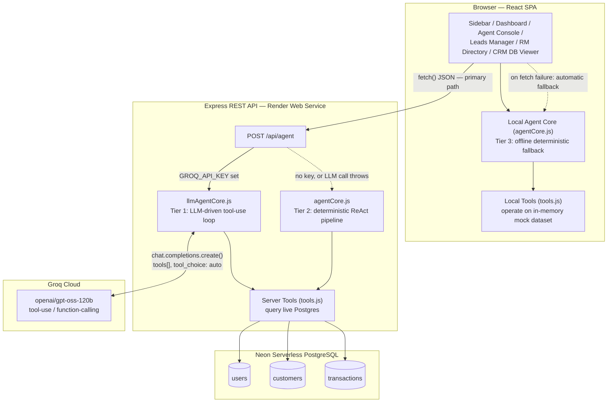
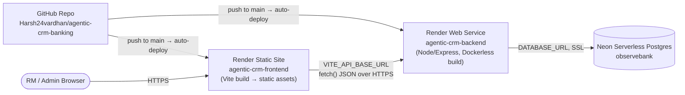
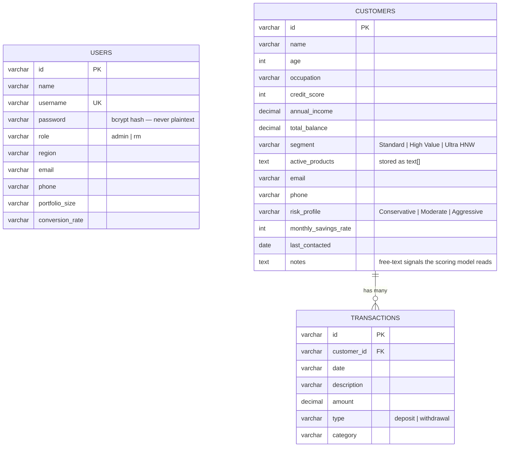
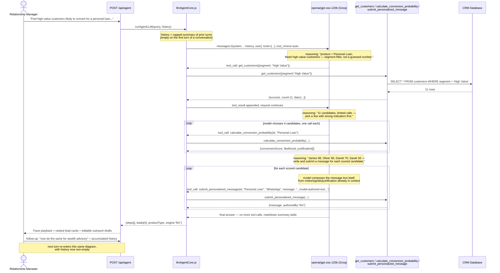
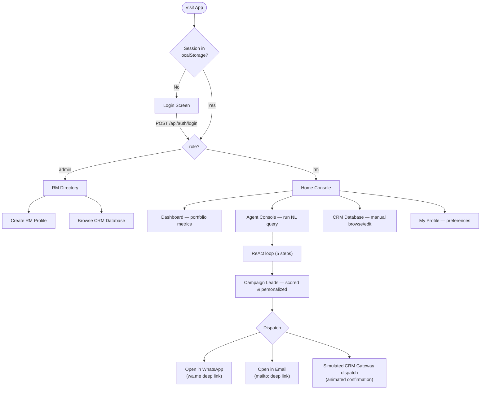

# Agentic AI System — Conversational Agentic AI for Banking CRM

A conversation-based Agentic AI system that helps a bank Relationship Manager (RM) go from a single natural-language request — *"Find high-value customers likely to convert for a personal loan this month and generate personalized WhatsApp messages"* — to a ranked, scored, and individually-personalized outreach campaign, with full visibility into every reasoning step the agent took to get there.

The agent's primary reasoning engine is a real LLM (Groq, `openai/gpt-oss-120b`) driving a genuine tool-use loop — it decides which of the 4 CRM tools to call, in what order, and how many candidates to pursue, based on the actual results of each call, not a fixed script. It's also genuinely conversational, not single-shot: a follow-up like *"now do the same for wealth advisory"* is resolved against a running summary of the conversation, and outreach copy is composed fresh by the model for each customer rather than assembled from a template. A deterministic heuristic pipeline stands behind it as an automatic fallback if no LLM key is configured or a call fails, so the system stays fully demoable either way. See [System Architecture](#system-architecture).

Built for the **Take-Home Assignment: Conversation-based Agentic AI for Banking CRM**.

**Live deployment:** [agentic-crm-frontend-plwc.onrender.com](https://agentic-crm-frontend-plwc.onrender.com) · **Repo:** [Harsh24vardhan/agentic-crm-banking](https://github.com/Harsh24vardhan/agentic-crm-banking)

---

## Table of Contents

1. [Problem Statement](#problem-statement)
2. [Live Demo & Credentials](#live-demo--credentials)
3. [Requirements Coverage](#requirements-coverage)
4. [System Architecture](#system-architecture)
5. [Deployment Topology](#deployment-topology)
6. [Data Model](#data-model)
7. [Agentic Reasoning & Execution Flow](#agentic-reasoning--execution-flow)
8. [Tool Design & Interface Definitions](#tool-design--interface-definitions)
9. [REST API Reference](#rest-api-reference)
10. [Conversion Scoring Model (Heuristics)](#conversion-scoring-model-heuristics)
11. [Role-Based Access & User Flows](#role-based-access--user-flows)
12. [Key Design Decisions](#key-design-decisions)
13. [Trade-offs & Limitations](#trade-offs--limitations)
14. [Tech Stack](#tech-stack)
15. [Project Structure](#project-structure)
16. [Setup & Run Instructions](#setup--run-instructions)
17. [Environment Variables](#environment-variables)
18. [Demo Video Guide](#demo-video-guide)

---

## Problem Statement

> A Relationship Manager asks: *"Find high-value customers likely to convert for a personal loan this month and generate personalized WhatsApp messages."*

The system must, without hardcoded output:
- Retrieve relevant customer and transaction data
- Identify high-value customers
- Estimate likelihood of conversion (rules/heuristics)
- Recommend a suitable product
- Generate a personalized outreach message per customer

Everything below documents how each of these is implemented and why.

---

## Live Demo & Credentials

| Service | URL |
|---|---|
| Frontend (RM Console) | https://agentic-crm-frontend-plwc.onrender.com |
| Backend (REST API) | https://agentic-crm-backend-i621.onrender.com |
| Health check | https://agentic-crm-backend-i621.onrender.com/health |

| Role | Username | Password | Lands on |
|---|---|---|---|
| Admin | `admin` | `password123` | RM Directory (create/manage RMs) |
| Relationship Manager | `sarah` | `password123` | Home Console (Agent, Leads, CRM DB) |

> Render's free tier suspends services after ~15 minutes of inactivity. The first request after idle can take 30–60s to wake up — this is a hosting-tier characteristic, not an application bug.

---

## Requirements Coverage

Direct mapping against the assignment brief, so it's auditable at a glance.

### Expected Capabilities

| Requirement | Implementation | Where |
|---|---|---|
| Retrieve relevant customer and transaction data | `get_customers`, `get_customer_transactions` tools query the live CRM tables | [`tools.js`](frontend/src/agent/tools.js), `GET /api/customers`, `GET /api/transactions/:id` |
| Identify high-value customers | Composable filters — balance, income, credit score, segment, risk profile — parsed from free text | `parseQueryIntent()` in [`agentCore.js`](frontend/src/agent/agentCore.js) |
| Estimate likelihood of conversion (rules/heuristics) | Per-product weighted heuristic scoring (not ML, not hardcoded) using income, credit score, balance, transaction patterns, and free-text profile notes | `calculate_conversion_probability()` — see [Conversion Scoring Model](#conversion-scoring-model-heuristics) |
| Recommend suitable products | Product intent detected from the query (`Personal Loan` / `Travel Elite Credit Card` / `Wealth Advisory`) plus a `recommendations[]` list per lead | `parseQueryIntent()`, `calculate_conversion_probability()` |
| Generate personalized outreach messages | Tier 1 (LLM): the model composes the message itself from the customer's real notes, transaction signals, and score justification — genuinely generated text, not a template. Tier 2/3 (fallback): message copy branches on real customer signals (loan expiry, occupation, travel notes, risk profile, segment) — not free-generated, but never a single static string either | `submit_personalized_message()` (Tier 1), `generate_personalized_message()` (Tier 2/3) |

### Expectations

| Requirement | How it's satisfied |
|---|---|
| Clear task decomposition | Primary path: an LLM (Groq `openai/gpt-oss-120b`) dynamically plans and re-plans based on live tool results via real tool-use/function-calling — not a fixed script. Fallback path: a deterministic 5-step plan (list → analyze → score → draft → compile). Both log an explicit Thought/Action/Observation per step, rendered live in the Agent Console trace panel |
| Effective tool/API usage | 4 composable agent tools, invocable either by an LLM tool-use loop or a deterministic pipeline, + a 15-route Express REST API + PostgreSQL — see [REST API Reference](#rest-api-reference) |
| Structured reasoning and execution flow | See the [sequence diagrams](#agentic-reasoning--execution-flow) below — every step's Thought/Action/Observation is logged and replayed in the UI at adjustable speed, for both engines |
| Proper state/context handling | Session state persisted in `localStorage`; agent trace state, leads hand-off from Agent Console → Leads Manager, and role-based routing all flow through explicit React state, not globals. Multi-turn conversation state (Tier 1 only) is a client-held, capped summary of prior turns threaded back through each request — see [Key Design Decision #15](#key-design-decisions) |
| Modular and extensible design | Strict separation: `/agent` (reasoning + tools), `/components` (presentation), `/db` (persistence), `/context` (cross-cutting UI concerns) — see [Project Structure](#project-structure) |

### Deliverables

- ✅ **GitHub Repository** — this repo, with the separation above
- ✅ **README** — architecture diagrams, execution flow, tool design, design decisions, trade-offs, setup instructions (this document)
- ⏳ **Demo Video (5–10 min)** — not produced by this session (I can write code and deploy, but can't record a screen video). See [Demo Video Guide](#demo-video-guide) for a ready-to-follow script covering 3+ use cases and architecture trade-offs.

### Avoiding disqualification criteria

- **"Hardcoded outputs without reasoning"** — every score is computed from live customer/transaction fields at request time (see the actual weighted rules in [Conversion Scoring Model](#conversion-scoring-model-heuristics)); every message branches on real profile content, not a fixed string. The primary engine additionally plans its own tool sequence via a real LLM tool-use loop — see [Agentic Reasoning & Execution Flow](#agentic-reasoning--execution-flow).
- **"No meaningful tool usage"** — 4 distinct tools with typed schemas, invoked with real data dependencies between calls (a later call's arguments depend on an earlier call's result) — either chosen dynamically by an LLM via function-calling, or chained deterministically as a fallback.
- **"Poor or missing documentation"** — this README.

---

## System Architecture

The agent has **three fallback tiers**, all sharing the same 4 tool contracts, so a missing API key, a rate limit, or a dead backend degrades the experience instead of breaking it:

1. **LLM-driven (primary, when `GROQ_API_KEY` is set)** — Claude-style tool-use loop against Groq (`openai/gpt-oss-120b`). The model itself decides which tools to call, in what order, and how many times, based on the actual results of each prior call.
2. **Deterministic heuristic pipeline (server fallback)** — a fixed 5-step plan (list → analyze → score → draft → compile) that runs if no Groq key is configured or the LLM call throws (rate limit, network error, etc.).
3. **Client-side offline pipeline (browser fallback)** — the same deterministic logic re-implemented against an in-memory dataset in the browser, used if the Express API itself is unreachable.



---

## Deployment Topology



- **Frontend**: static Vite build, served by Render's static host with a SPA catch-all rewrite (`/* → /index.html`) so client-side routes survive refresh/direct navigation.
- **Backend**: Node/Express web service. Build step runs `npm install && npm run seed` — the seeder creates the schema and inserts baseline data on every deploy (see [Trade-offs](#trade-offs--limitations) for the implication of this).
- **Database**: Neon's serverless Postgres — connects over `DATABASE_URL` with SSL, autoscaling compute down to zero when idle.
- Also portable to **Docker Compose** (local Postgres) or **Fly.io/Koyeb** (config already present as `fly.toml` / Dockerfile) — the app has no hosting-specific code paths.

---

## Data Model



`notes` is the highest-leverage field in the schema — it's unstructured free text (e.g. *"active personal loan expiring next month"*, *"frequent business trips to Italy"*), and both the scoring model and the message generator read it directly to drive personalization. This is the deliberate design choice that keeps outputs from feeling templated.

---

## Agentic Reasoning & Execution Flow

### Tier 1 — LLM-driven dynamic loop (primary path)

[`backend/src/agent/llmAgentCore.js`](backend/src/agent/llmAgentCore.js) hands the query to `openai/gpt-oss-120b` on Groq with the 4 tools declared as function-calling schemas and `tool_choice: "auto"`. **The model decides the plan** — how many tool calls to make, in what order, whether to check transaction history at all, and when it has enough to stop — by reading the actual result of each call before deciding the next one. This is a genuine multi-turn tool-use loop, not a scripted sequence with dynamic parameters.

This is real, observed behavior from a live run (not a hypothetical), captured verbatim from the trace:



The model's own `reasoning` output is captured verbatim into each step's `thought` field — the trace panel shows *the model's actual chain of thought* ("We have 11 high-value customers... limited calls; maybe pick a few with strong indicators..."), not a synthetic label. Iteration is capped at 12 tool calls as a safety bound, not a fixed plan length.

**Multi-turn conversations.** `AgentConsole.jsx` keeps a running, capped (12-turn) summary of the conversation client-side — not a raw tool-call transcript, just one compact line per turn (`buildTurnSummary()`) — and sends it back as `history` on every subsequent `/api/agent` call. The system prompt tells the model how to use it: resolve references like *"the same customers"* or *"only the ones above 700 credit score"* against the summary, but re-call the tools if the current request needs fresher or more detailed data than a lossy recap can provide. A **New Conversation** control in the UI clears the history explicitly; the three preset use-case buttons also start fresh automatically, since they're independent demo scenarios, not turns of one conversation. This is Tier 1 only — see [Key Design Decision #15](#key-design-decisions) for why Tier 2/3 stay single-turn.

### Tier 2 — Deterministic heuristic pipeline (server fallback)

[`backend/src/agent/agentCore.js`](backend/src/agent/agentCore.js) runs if `GROQ_API_KEY` is unset or the LLM call throws (rate limit, network error, refusal). This is a fixed, auditable 5-step ReAct-style plan — the *plan* is deterministic, but every step's *content* (what it found, how many, which names) is computed live from real data, not templated:

```mermaid
sequenceDiagram
    actor RM as Relationship Manager
    participant Core as agentCore.js (deterministic)
    participant T1 as get_customers
    participant T2 as get_customer_transactions
    participant T3 as calculate_conversion_probability
    participant T4 as generate_personalized_message
    participant DB as CRM Database

    RM->>Core: runAgent(query)
    Core->>Core: parseQueryIntent() → {productType, filters}

    rect rgb(30, 41, 59)
    note over Core: Step 1 — Task Decomposition & Plan
    Core->>T1: get_customers(filters)
    T1->>DB: SELECT * FROM customers WHERE ...
    DB-->>T1: matching rows
    T1-->>Core: {success, count, data}
    end

    rect rgb(30, 41, 59)
    note over Core: Step 2 — Transaction History Analysis
    loop for each candidate
        Core->>T2: get_customer_transactions(id)
        T2-->>Core: travel / salary / recency markers
    end
    end

    rect rgb(30, 41, 59)
    note over Core: Step 3 — Conversion Probability Scoring
    loop for each candidate
        Core->>T3: calculate_conversion_probability(id, productType)
        T3-->>Core: {score, likelihood, justification[], recommendations[]}
    end
    Core->>Core: sort leads by score, descending
    end

    rect rgb(30, 41, 59)
    note over Core: Step 4 — Personalized Outreach Drafting
    loop for each scored lead
        Core->>T4: generate_personalized_message(id, productType, channel)
        T4-->>Core: personalized WhatsApp/Email draft
    end
    end

    note over Core: Step 5 — Final Compilation
    Core-->>RM: {steps[], leads[], productType, engine:"heuristic"}
```



Both tiers return the identical `{steps[], leads[], productType, engine}` shape, so the Agent Console's trace-playback UI (**Slow / Normal / Fast** speed, or skip straight to compiled leads) renders either one without knowing which engine produced it. The `engine` field (`"llm"`, `"heuristic"`, or `"offline"`) is surfaced directly in the UI as a badge next to the execution log — "LLM-driven (Groq)", "Deterministic Engine", or "Offline Fallback", each styled distinctly — so which tier actually served a given run is visible at a glance during a demo, not something you have to infer or check the network tab for.

---

## Tool Design & Interface Definitions

Registered functions in [`frontend/src/agent/tools.js`](frontend/src/agent/tools.js) (client fallback) and [`backend/src/agent/tools.js`](backend/src/agent/tools.js) (server, backed by Postgres via `db/index.js`). The first three tools are identical contracts across all three tiers; the fourth intentionally is *not* — see below.

### 1. `get_customers(filters)`
Queries the CRM customer table with composable filters.
- **Arguments**: `{ minBalance?, minCreditScore?, minIncome?, segment?, riskProfile?, occupation?, name? }`
- **Output**: `{ success: boolean, count: number, data: Customer[] }`

### 2. `get_customer_transactions(customerId)`
Fetches the full transaction ledger for one customer.
- **Arguments**: `customerId: string`
- **Output**: `{ success: boolean, customerId, customerName, count, data: Transaction[] }`

### 3. `calculate_conversion_probability(customerId, productType)`
Runs the heuristic scoring model (full rules in the [next section](#conversion-scoring-model-heuristics)).
- **Arguments**: `customerId: string`, `productType: "Personal Loan" | "Travel Elite Credit Card" | "Wealth Advisory"`
- **Output**: `{ success, customerId, customerName, productType, conversionScore: 0-100, likelihood: "High"|"Medium"|"Low", justification: string[], recommendations: string[] }`

### 4. Outreach drafting — deliberately different contracts per tier

This is the one tool whose contract is *not* shared across tiers, on purpose (see [Key Design Decision #16](#key-design-decisions)):

- **Tier 1 (LLM) — `submit_personalized_message(customerId, productType, channel, message)`**: the `message` is a **required argument the model writes itself**, using the customer's real notes, transaction signals, and score justification it already gathered earlier in the same run. The tool's own code does no copywriting — it validates the message is non-empty and attaches the customer envelope. This is what makes Tier 1 output genuinely generative rather than a templated fill-in.
  - **Output**: `{ success, customerId, customerName, productType, channel, message, authoredBy: "llm" }`
- **Tier 2/3 (deterministic/offline) — `generate_personalized_message(customerId, productType, channel)`**: drafts channel-specific copy by branching on the customer's real notes/segment/risk profile inside `shared/heuristics.js`. Same customer in, same message out, every time — which is the entire point of a fallback tier: predictable, instant, free, and reviewed copy when there's no model in the loop.
  - **Output**: `{ success, customerId, customerName, productType, channel, message }`

---

## REST API Reference

Express server ([`backend/server.js`](backend/server.js)), all routes prefixed by the deployed backend origin.

| Method | Route | Purpose |
|---|---|---|
| `GET` | `/health` | Liveness + DB connectivity status |
| `GET` | `/api/customers` | List customers, with query-string filters |
| `POST` | `/api/customers` | Add a new CRM customer |
| `PUT` | `/api/customers/:id` | Update an existing customer profile |
| `GET` | `/api/transactions` | List all transactions |
| `GET` | `/api/transactions/:customerId` | Transaction ledger for one customer |
| `POST` | `/api/transactions` | Log a new transaction |
| `GET` | `/api/score/:customerId/:productType` | Run the scoring model for one customer/product pair |
| `GET` | `/api/outreach/:customerId/:productType/:channel` | Generate one personalized message |
| `POST` | `/api/agent` | Full natural-language query → agent run → ranked leads. Body: `{ query, history? }` — `history` (optional, Tier 1 only) is a capped array of `{role, content}` turn summaries for follow-up requests. LLM-driven if `GROQ_API_KEY` is set, deterministic otherwise; response includes `engine: "llm" \| "heuristic"` |
| `POST` | `/api/auth/login` | Username/password authentication |
| `GET` | `/api/rms` | List Relationship Managers (admin) |
| `POST` | `/api/rms` | Create a new RM account (admin). Validated server-side via `shared/validators.js` — 400 with a per-field `errors` object on failure |
| `DELETE` | `/api/rms/:id` | Remove an RM account (admin). Scoped to `role = 'rm'` — cannot delete the admin account even if its id is passed directly |
| `GET` | `/api/logs` | In-memory ring buffer of recent request logs (ops/debugging) |

---

## Conversion Scoring Model (Heuristics)

This is the part that proves the output isn't hardcoded: three independent weighted rule sets, one per product, each reading different real fields off the customer record.

**Personal Loan** — starts at 0, then:
- `+25` if annual income > ₹120k, `+15` if > ₹80k, `−20` if < ₹40k
- `+25` if credit score ≥ 750, `+15` if ≥ 680, `−30` if below
- `+30` if notes mention financing/liquidity/expansion intent
- `+35` if notes indicate an *existing* loan is expiring (refinance signal — this is the single strongest positive factor in the model)
- `−40` if notes explicitly state reluctance to take on debt
- `+10` if total balance > ₹100k (asset backing)
- Clamped to `[5, 98]`

**Travel Elite Credit Card**:
- `+45` for 3+ travel transactions in the last 30 days, `+20` for 1–2
- `+25` for foreign-transaction fees or international-travel notes
- `+20` if credit score ≥ 720, `−35` if < 640
- Score forced to `5` if the customer already holds a travel card (no point pitching a duplicate)

**Wealth Advisory**:
- `+50` for Ultra HNW balance (≥ ₹300k), `+35` for High Value (≥ ₹100k), `−40` if < ₹20k
- `+25` for explicit wealth/estate-planning interest in notes
- `+15` if funds are sitting in low-yield savings products (an upsell signal)
- Score forced to `15` if already enrolled in full wealth management

Final `likelihood` label: **High** (score > 75), **Medium** (> 45), **Low** (otherwise). Every contributing factor is returned in `justification[]` and rendered verbatim in the UI, so the RM sees *why* a lead scored the way it did, not just the number.

Message generation ([`generate_personalized_message`](frontend/src/agent/tools.js)) branches similarly — e.g. a Personal Loan message reads differently for a customer whose notes say "loan expiring next month" (refinance-toned) versus a dentist with "practice expansion" notes (equipment-financing-toned) versus a generic pre-approval.

---

## Role-Based Access & User Flows



| Capability | Admin | Relationship Manager |
|---|---|---|
| Create/list RM accounts | ✅ | ❌ |
| Browse/edit CRM customers & transactions | ✅ | ✅ |
| Run the Agent Console (NL queries) | ❌ | ✅ |
| View Dashboard metrics | ❌ | ✅ |
| Campaign Leads / outreach dispatch | ❌ | ✅ |
| Own profile & preferences | ❌ (fixed identity) | ✅ |

---

## Key Design Decisions

1. **Real LLM-driven tool orchestration, with a deterministic fallback that keeps it demoable under any budget/quota.** The agent's first choice is a genuine tool-use loop against an LLM (Groq `openai/gpt-oss-120b`) — the model decides what to call and when, not a script. But a take-home assignment shouldn't hard-depend on a paid API staying available during grading, so `POST /api/agent` tries the LLM path first and transparently falls back to a deterministic heuristic pipeline if `GROQ_API_KEY` is unset *or* the call throws for any reason (network error, malformed response, and — concretely observed during development — a free-tier 429 rate-limit after repeated testing). Both paths return the same `{steps[], leads[], productType, engine}` shape, so the frontend doesn't need to know which one ran.

2. **Three-tier fallback in total.** Stacking on top of (1): if the Express API itself is unreachable, every data-fetching component re-runs the same tool logic against an in-memory dataset in the browser (`frontend/src/agent/`). So the demo works with no backend running at all, with a backend but no LLM key, or with everything configured — the UI degrades, never breaks.

3. **Rule-based heuristic scoring over ML** — a transparent, inspectable weighted-rule model (see above) instead of a black-box classifier. For a CRM tool an RM has to trust and explain to a compliance reviewer, "here are the 4 reasons this customer scored 82%" is more valuable than an opaque model score.

4. **Vanilla CSS design system** — a custom theme (`index.css`) using CSS variables, glassmorphism, and a dark-navy/neon-cyan palette with a full light-theme override, rather than a utility framework. Gives complete visual ownership and keeps the bundle lean.

5. **Global toast notification system** — a single `ToastProvider`/`useToast()` context (`frontend/src/context/ToastContext.jsx`) replaced several one-off local toast implementations, so every mutating action (login, logout, RM creation, customer add/update, transaction logging, lead dispatch, agent scan completion) reports success/error consistently from one place.

6. **Real communication deep-links, not just simulation** — the dispatch modal keeps its animated "CRM Gateway" simulation for the demo narrative, but also offers **Open in WhatsApp** (`wa.me/<phone>?text=<message>`) and **Open in Email App** (`mailto:`) buttons that hand off to the RM's real client with the generated message pre-filled.

7. **Responsive layout via CSS breakpoints, not a JS drawer** — the sidebar collapses to an icon-only rail below 820px purely through media queries (no new component state), keeping the change surface small. Tables already scroll horizontally and modals already cap at `90vw`, so most of the layout degrades gracefully by default.

8. **INR display localization** — all currency in the UI, message templates, and the NL query parser uses `₹` instead of `$`. This is a **display-symbol change only** — see [Trade-offs](#trade-offs--limitations).

9. **Infrastructure-as-config across three providers** — `render.yaml`, `fly.toml`, and `docker-compose.yml` all describe the same service topology, so the same codebase deploys unmodified to Render, Fly.io, or a local Docker stack.

10. **A `/shared` package as the single source of truth for business logic.** Earlier, `mockDatabase.js`, the heuristic scoring/messaging rules, and the NL query parser were hand-duplicated between `frontend/src/agent/` and `backend/src/agent/` — a real maintenance smell where the same rule could silently drift between the two copies. All three are now pure, side-effect-free modules in `/shared` (`mockDatabase.js`, `heuristics.js`, `queryParser.js`), imported by both runtimes. What's left duplicated (`get_customers`/`get_customer_transactions` in each `tools.js`) is *legitimately* different — one filters an in-memory array, the other queries Postgres — not accidental duplication.

11. **A concrete bug the de-dup pass surfaced: the regex parser broke on the assignment's own example query.** Consolidating `parseQueryIntent()` into `/shared/queryParser.js` meant re-reading it closely, which surfaced a real bug: the name-extraction regex matched the literal substring `"customer"` *inside* `"customers"` and captured trailing filler words as a fake name filter — so *"Find high-value customers likely to convert for a personal loan..."* (the assignment's literal example) silently returned **zero leads** on the deterministic path. Fixed by requiring an explicit, capitalized `"customer NAME"` / `"client NAME"` phrase matched against the original (non-lowercased) query, and by dropping the bare `"for X"` trigger that was catching ordinary prose. Verified before/after: 0 leads → 11 leads on the exact same query.

12. **Passwords are bcrypt-hashed end to end, not stored or compared as plaintext.** `seed.js` hashes both baseline accounts before insert; `addRmDb` hashes on every new RM creation, on both the Postgres path and the in-memory-fallback path; `loginUserDb` verifies with `bcrypt.compare()` against the stored hash instead of a `===` string check. The mock-array fallback (only active when Postgres itself is unreachable) hashes its demo users once at startup into a separate `Map` and immediately deletes the plaintext `password` field from the array — closing a real secondary leak this surfaced: `getRmsDb()`'s mock-array branch was returning raw user objects, plaintext password included, to `GET /api/rms`. `bcryptjs` (pure JS, no native build step) was chosen over `bcrypt` specifically to avoid adding a native-compile dependency to a Render build pipeline that's already had enough deployment friction this project.

13. **An engine badge makes the fallback tier visible in the UI, not just inferable from the JSON.** The entire point of the three-tier design is that a demo keeps working when the LLM is rate-limited or unconfigured — but a fallback response looks visually identical to an LLM response unless something calls it out, which would make the resilience story invisible in a demo. `AgentConsole.jsx` now renders a small badge next to the execution log naming the engine that actually served the current result.

14. **A `node:test` suite locks in the two riskiest pure-logic modules, including a regression test for #11.** `shared/heuristics.test.js` and `shared/queryParser.test.js` (29 tests, zero new dependencies — Node's built-in test runner) cover the scoring model's clamping/likelihood-threshold behavior, the "already owns this product" score overrides, and — critically — assert that the assignment's exact example query never re-acquires a spurious name filter. Run with `npm test` from the repo root.

15. **Multi-turn conversation state is a client-held, capped summary — not server sessions and not a raw transcript replay.** The assignment is literally titled *"conversation-based"* Agentic AI, but the first cut of this system was single-turn: every query started a cold `messages=[system, user]`, with no way to say *"now do the same for wealth advisory"* as a follow-up. Two implementation options existed: server-side session storage (keyed by a session ID), or client-held history sent back on each request. Server sessions were rejected for a concrete, deployment-specific reason — Render's free tier sleeps the backend after ~15 min idle, and in-process session state doesn't survive that (or a redeploy); it would look like memory that silently evaporates mid-demo. `AgentConsole.jsx` instead keeps an array of compact turn summaries (`buildTurnSummary()` — one line per turn: the query plus which customers were found/scored, not a full tool-call transcript) and POSTs it as `history` alongside each new query, capped at 12 turns on both ends (client and `llmAgentCore.js`, defense in depth). This keeps a long conversation's token cost roughly flat instead of compounding turn-over-turn, which matters directly for the rate-limit trade-off below. This capability is Tier 1 (LLM) only — Tier 2/3 remain intentionally single-turn, since faking conversational memory on top of a regex parser would be exactly the kind of dishonest "looks agentic but isn't" behavior this README argues against elsewhere.

16. **The LLM tier writes outreach messages itself; the fallback tiers still use templates — on purpose, not as an oversight.** Originally, all three tiers called the same `generate_personalized_message` tool, which always ran the same `shared/heuristics.js` template selector — meaning the *same customer* produced byte-identical copy whether the "intelligent" LLM tier or the deterministic fallback served the request. That's a real gap: an interviewer asking "does the LLM actually write the message, or just decide who gets one?" deserved an honest "just decide," which wasn't good enough. Fixed by splitting the contract (see [Tool Design](#tool-design--interface-definitions) #4): Tier 1 now calls `submit_personalized_message(customerId, productType, channel, message)`, where `message` is a required argument **the model composes itself** from the customer notes, transaction signals, and score justification already in its context — the tool only validates and records it. Tier 2/3 keep calling the original `generate_personalized_message`, which still drafts from templates. This is deliberately *not* unified: a fallback tier's entire value is being predictable, instant, and free — template output is a feature there, not a limitation to hide.

17. **The Agent Console survives tab navigation by staying mounted, not by lifting its state.** Switching tabs used to fully unmount `AgentConsole` (a plain `switch` in `App.jsx`'s render), which destroyed its local state — a completed run, or one still mid-playback, vanished the moment you clicked away and had to be re-run. The fix is a CSS visibility toggle, not a state-lifting refactor: for non-admin users, `AgentConsole` is always rendered inside a wrapper that's `display: contents` when active and `display: none` otherwise, so the component instance (and every `useState` in it — query, trace, leads, conversation history) is preserved across navigation instead of being torn down and rebuilt. Chosen over lifting all 8 pieces of AgentConsole's state up into `App.jsx`: that would have worked too, but turns every other tab's render into prop-drilling for state only one tab uses, for a component that was already self-contained. A one-line render change had a much smaller blast radius than restructuring `App.jsx`'s state ownership.

18. **RM account management got the same "never trust client-only checks" treatment as everything else, plus a delete path admin never had.** Two gaps surfaced together: the RM-creation form accepted anything (a name of `"123456"` was valid), and there was no way to remove an RM once created. Fixed both: `shared/validators.js` is a new pure module (name/username/password/email/phone rules) in the same spirit as `heuristics.js`/`queryParser.js` — imported by the React form for instant inline feedback *and* by the Express route for real enforcement, so the two can't drift apart. `DELETE /api/rms/:id` was added and deliberately scoped to `role = 'rm'` in the SQL/mock-array filter itself, not just in the UI — passing the admin account's own id to this route is a no-op failure, not a lockout risk. The customer Add/Edit forms in `DatabaseViewer.jsx` had the identical name-validation gap and got the same fix reusing the same module, since it was the same bug class in a second location.

19. **The Groq client now fails fast instead of silently retrying for however long the API asks it to wait.** Root-caused, not guessed at: `groq-sdk` defaults to `maxRetries: 2`, and its retry logic (`client.mjs`) honors a `retry-after`/`retry-after-ms` response header verbatim with no upper bound — on a daily-quota 429 (this project's own testing hit exactly this), Groq's response suggests waiting tens of *minutes*, and the SDK will `await sleep()` for that entire duration before even attempting a retry. That single await blocked the whole `/api/agent` request, which is what actually made the endpoint "slow" under load — not model latency. Fixed with `new Groq({ maxRetries: 0, timeout: 30000 })`: since `server.js` already has a proven, faster fallback (the deterministic engine) for exactly this situation, there's no reason to wait and retry the same degraded call first. Confirmed directly: the same rate-limited account that previously implied a 30-48 minute wait now throws immediately, measured in the low hundreds of milliseconds.

20. **Preferences & Settings now actually persists and does something, instead of an `alert()`.** The Save button called `alert("Settings saved successfully!")` — a hardcoded success message with no backing state at all; every setting reset the moment you left the page. Fixed with `frontend/src/utils/preferences.js`, a small localStorage-backed store keyed per user id (so a shared branch machine doesn't leak one RM's settings into another's session). More importantly, the settings now do something: `AgentConsole`'s playback speed and `LeadsManager`'s default outreach channel both initialize from the saved preference instead of a hardcoded value, closing the gap where the page's own copy ("Customize your AI console behavior and dispatch defaults") was aspirational rather than true.

---

## Trade-offs & Limitations

- **LLM path latency is real and variable.** Because the model plans dynamically — deciding how many candidates to explore, whether to check transaction history, how many to score — a single request can take anywhere from ~20 seconds to a few minutes depending on how many tool-call round-trips it chooses to make. This is a genuine cost of *real* dynamic planning versus a fixed-length script: the fixed deterministic pipeline is near-instant precisely because it doesn't reason about how much work to do. `reasoning_effort: "low"` is set on the Groq call to cut this down (the heavy lifting — scoring math, message templates — happens in our own deterministic tools, not the model, so deep reasoning isn't needed for orchestration), but multi-turn tool loops are inherently slower than a single call.
- **Groq's free tier has real rate limits, on two separate axes, both confirmed directly (not hypothetical).** 8,000 tokens/minute is documented; during this project's own testing, a **200,000 tokens/day** organization-wide cap was also hit and confirmed from the API's own error response (`"Limit 200000, Used 195457"`), with a rolling window that clears over roughly an hour rather than a fixed calendar-day reset. A multi-turn tool-use conversation resends the full message history each turn, and conversation `history` (Key Design Decision #15) adds a small amount more per follow-up — both compound token usage, which eats into whichever of the two limits is tighter at the time. Hitting either isn't a failure mode here: `POST /api/agent` catches the error and falls back to the deterministic engine (see [Key Design Decisions](#key-design-decisions) #1), so the RM still gets a working result, just from the fallback path — and as of Key Design Decision #19, that fallback now kicks in within milliseconds of the 429 instead of after the SDK's own multi-minute retry wait.
- **The model doesn't always pick optimal tool arguments on the first try.** In one observed run, the model initially guessed several unrealistic numeric thresholds (`minBalance: 500000`, etc.) for a "high-value" request before self-correcting to use the `segment` field — costing several wasted tool calls. Tightened the tool description and system prompt to explicitly steer qualitative terms toward the `segment` enum instead of invented numbers, which fixed it in testing, but it's a reminder that LLM tool-use quality is sensitive to prompt/schema wording, not just the underlying model's capability.
- **Deterministic-path NL parsing is regex/keyword matching, not an LLM.** This only applies to Tier 2 (the fallback) — it guarantees zero API latency, zero cost, and 100% uptime when it's the active path, but it requires roughly standard phrasing (recognizes "balance", "credit score", "loan", "travel", "wealth", etc.) and won't handle arbitrary paraphrasing the way the LLM tier does.
- **LLM-authored messages (Tier 1) are generated text, with the usual generation risk that comes with that.** Because `submit_personalized_message` now takes model-written copy instead of validated template output, Tier 1 messages can in principle drift — an invented specific or a phrasing an RM wouldn't approve — in a way a fixed template structurally cannot. The system prompt constrains tone, length, and requires grounding in a real customer detail, and the trace log shows the exact text that was submitted for review, but nothing enforces the constraints at the code level the way a template does. Treat Tier 1 output as an RM-reviewed draft, not an auto-send. Tier 2/3 output has no such caveat — same input always produces the same, previously-reviewed copy.
- **Conversation history is a lossy summary, not a full replay, and is Tier 1 only.** Follow-ups work by giving the model a compact recap (customer names, IDs, scores — not the original tool results or its own past reasoning), capped at 12 turns. This is enough for the model to resolve "the same customers" or pivot the product, but a request that needs precise figures from three turns ago may cause it to re-query rather than recall exactly — which is the intended, safer behavior (see Key Design Decision #15), but means the conversation isn't a perfect memory. Tier 2/3 ignore `history` entirely and answer every query fresh.
- **Currency is a symbol swap, not an FX conversion.** Per a later request, all `$` were changed to `₹` — the underlying numeric magnitudes are unchanged from the original mock dataset. A customer shown as "₹135,000 income" has the same numeral as it did as "$135,000"; there's no real USD→INR rate applied. Worth knowing if the numbers are read literally.
- **Dispatch is simulated + optionally deep-linked, not a real send.** The animated "Broadcasting via Twilio API..." sequence is a UX simulation. The WhatsApp/Email buttons *do* open a real compose window via `wa.me`/`mailto:`, but nothing in this codebase calls an actual messaging/SMTP provider (e.g. Twilio, SendGrid) — that would be the next integration point.
- **Database reseeds on every backend deploy.** Render's build command is `npm install && npm run seed`, and `seed.js` drops and recreates all three tables before inserting baseline data. Any RM or customer added through the UI in production is lost on the next deploy. Fixable by making the seed idempotent (skip if `users` is non-empty) — flagged but not changed, since it would alter existing deploy behavior without an explicit go-ahead.
- **Mock dataset size.** 20 customers, ~50 transactions — enough to demonstrate selective filtering and varied scoring outcomes, not a production-scale dataset.
- **Test coverage is unit-level, not end-to-end.** `shared/heuristics.js` and `shared/queryParser.js` — the two modules where a silent logic bug would be hardest to spot by eye (see Key Design Decision #11) — have a `node:test` suite (`npm test`, 29 tests, zero new dependencies). The Express routes, the LLM tool-use loop, and the React components are still verified manually plus headless-browser smoke checks, not by an automated integration/E2E suite.
- **Render free-tier cold starts.** Both services sleep after ~15 min idle; first request after that takes 30–60s.

---

## Tech Stack

| Layer | Choice |
|---|---|
| Frontend | React 19, Vite 8, vanilla CSS (custom design system), `lucide-react` icons |
| Backend | Node.js, Express 4 |
| LLM (agent orchestration) | Groq (`groq-sdk`), model `openai/gpt-oss-120b` — free tier, OpenAI-compatible tool-use API |
| Database | PostgreSQL — Neon (serverless, production) / Docker `postgres:15-alpine` (local) |
| Auth | `bcryptjs` password hashing (pure JS, no native build step) |
| Testing | Node's built-in `node:test` + `assert/strict` — zero added dependencies |
| Linting | `oxlint` |
| Deployment | Render (backend web service + frontend static site), Neon (managed Postgres) |
| Alternate deploy targets | Fly.io (`fly.toml`), Koyeb/Docker (`Dockerfile`), Docker Compose (full local stack) |

---

## Project Structure

```
Assingment/
├── shared/                        # Single source of truth, imported by both runtimes
│   ├── mockDatabase.js            # Seed data source (customers, transactions, users)
│   ├── heuristics.js              # Pure scoring model + message drafting rules
│   ├── heuristics.test.js         # node:test suite for the scoring model
│   ├── queryParser.js             # NL → {productType, filters} for the deterministic tier
│   ├── queryParser.test.js        # node:test suite, incl. the Key Design Decision #11 regression
│   ├── validators.js              # Name/username/password/email/phone rules, used client + server
│   ├── validators.test.js         # node:test suite for the validation rules
│   └── package.json               # {"type": "module"} so both ESM apps resolve it cleanly
│
├── backend/
│   ├── server.js                  # Express app, 15 REST routes
│   ├── src/
│   │   ├── agent/
│   │   │   ├── llmAgentCore.js    # Tier 1: LLM-driven tool-use loop (Groq)
│   │   │   ├── agentCore.js       # Tier 2: deterministic ReAct orchestrator
│   │   │   └── tools.js           # 4 agent tools (Postgres-backed), used by both tiers
│   │   └── db/
│   │       ├── index.js           # Postgres query layer (pg Pool)
│   │       └── seed.js            # Schema creation + baseline data seeder
│   ├── Dockerfile / fly.toml / start.sh
│   └── package.json
│
├── frontend/
│   ├── src/
│   │   ├── agent/                 # Tier 3: client-side offline fallback (mirrors tools.js/agentCore.js)
│   │   ├── utils/
│   │   │   └── preferences.js     # localStorage-backed RM console settings (per-user scoped)
│   │   ├── components/
│   │   │   ├── Login.jsx, Sidebar.jsx, BrandLogo.jsx
│   │   │   ├── HomePage.jsx, DashboardMetrics.jsx
│   │   │   ├── AgentConsole.jsx        # Trace playback UI (renders either engine's output; stays mounted across tab switches)
│   │   │   ├── LeadsManager.jsx        # Scored leads + dispatch modal
│   │   │   ├── DatabaseViewer.jsx      # CRM customer/transaction CRUD
│   │   │   ├── RmManager.jsx           # Admin: RM directory + creation
│   │   │   └── UserProfile.jsx
│   │   ├── context/
│   │   │   └── ToastContext.jsx   # Global success/error notifications
│   │   ├── App.jsx                 # Role-based routing, session state
│   │   ├── config.js               # API base URL resolution
│   │   └── index.css               # Full design system + responsive breakpoints
│   ├── public/logo.svg
│   └── package.json
│
├── docker-compose.yml              # Full local stack: Postgres + backend + frontend
├── render.yaml                     # Render Blueprint (backend + frontend + Postgres)
└── package.json                    # Root orchestrator (concurrently runs both apps)
```

---

## Setup & Run Instructions

### Option A — Docker Compose (recommended, fully automated)

```bash
docker compose up --build
```
Spins up Postgres 15, builds and seeds the backend on `:5000`, builds and serves the frontend on `:5173`. Open [http://localhost:5173](http://localhost:5173).

### Option B — Root orchestrator (no Docker)

```bash
npm run setup   # installs deps in root, backend, and frontend
npm start       # runs backend (:5000) and frontend (:5173) concurrently
```

### Option C — Manual, per-service

```bash
# Backend
cd backend
npm install
npm run seed    # creates schema + baseline data in Postgres
npm start       # http://localhost:5000

# Frontend (separate terminal)
cd frontend
npm install
npm run dev     # http://localhost:5173
```

> **Offline-capable by design**: if you run only the frontend, every component detects the failed `fetch()` and transparently falls back to the client-side agent running against an in-memory dataset — no backend required to demo the core reasoning flow.

### Testing

```bash
npm test        # from the repo root
```

Runs the `node:test` suite (`shared/heuristics.test.js`, `shared/queryParser.test.js`, `shared/validators.test.js` — 46 tests total) covering the conversion-scoring model, the NL query parser, and the RM/customer input-validation rules — including a regression test for the query-parser bug documented in [Key Design Decision #11](#key-design-decisions). No test-framework dependency; uses Node's built-in runner.

---

## Environment Variables

### Backend
| Variable | Purpose | Default |
|---|---|---|
| `PORT` | HTTP port | `5000` (`10000` on Render) |
| `DATABASE_URL` | Full Postgres connection string (used in production/Neon) | — |
| `PGHOST` / `PGPORT` / `PGUSER` / `PGPASSWORD` / `PGDATABASE` | Discrete Postgres connection params (used if `DATABASE_URL` absent, e.g. local Docker) | `localhost` / `5432` / `postgres` / `postgres` / `observebank` |
| `GROQ_API_KEY` | Enables the Tier 1 LLM-driven agent (console.groq.com, free, no card). Unset → deterministic Tier 2 pipeline runs instead | — |
| `GROQ_MODEL` | Override the Groq model used for tool orchestration | `openai/gpt-oss-120b` |
| `NODE_ENV` | Environment flag | `development` |

### Frontend
| Variable | Purpose | Default |
|---|---|---|
| `VITE_API_BASE_URL` | Backend origin the SPA calls | `http://localhost:5000` |

---

## Demo Video Guide

Not recorded as part of this session — here's a script hitting everything the brief asks for (3+ use cases, architecture trade-offs) in ~7 minutes:

1. **(1 min) Architecture** — walk through the [System Architecture](#system-architecture) diagram: the three-tier fallback (LLM → deterministic → offline), Postgres.
2. **(1–2 min) Use Case 1 — Personal Loan, LLM-driven**: log in as `sarah`, Agent Console → *"Find high-value customers likely to convert for a personal loan this month and generate personalized WhatsApp messages"* → narrate the trace playback, pointing out that the `thought` text is the model's **actual reasoning output**, not a canned label — call out the **LLM-driven (Groq)** engine badge next to the execution log. Open a lead, show the score justification and the generated message, and note it was composed by the model itself, not pulled from a template.
3. **(1 min) Use Case 2 — Multi-turn follow-up**: without clicking "New Conversation," type a follow-up in the same box — e.g. *"now do the same thing but for wealth advisory"* — and show the conversation pill trail above the input, then the new trace resolving "the same" against the prior turn. This is the direct answer to "is this actually conversation-based, or just single-shot Q&A?"
4. **(1 min) Use Case 3 — Travel Card**: click **New Conversation** first, then run the "Premium Travel Card Upgrades" preset → point out the score changes for a different heuristic rule set (travel transaction count, foreign fees).
5. **(30 sec) Use Case 4 — Wealth Advisory (fresh)**: run the HNW preset → show the Conservative vs. growth-oriented message branching, and that phrasing differs customer-to-customer even at similar scores (proof the copy isn't one fixed string).
6. **(1 min) Dispatch**: open a lead's dispatch modal, click **Open in WhatsApp** to show the real deep-link, then **Confirm & Send** to show the simulated CRM gateway animation.
7. **(1 min) Admin side**: log out, log in as `admin`, create a new RM, show the RM Directory.
8. **(1 min) Trade-offs**: LLM latency/rate-limit trade-offs (including the two separate Groq limits actually hit during development), the deterministic fallback and its engine badge, LLM-authored messages being a review-before-send draft rather than an auto-send, the reseed-on-deploy caveat — see [Trade-offs & Limitations](#trade-offs--limitations) for the full list to draw from.
